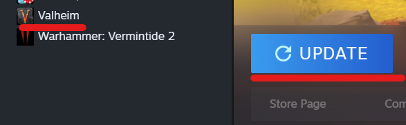
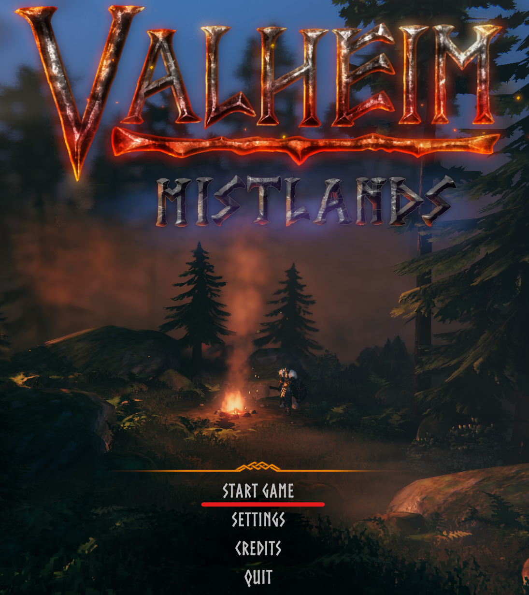
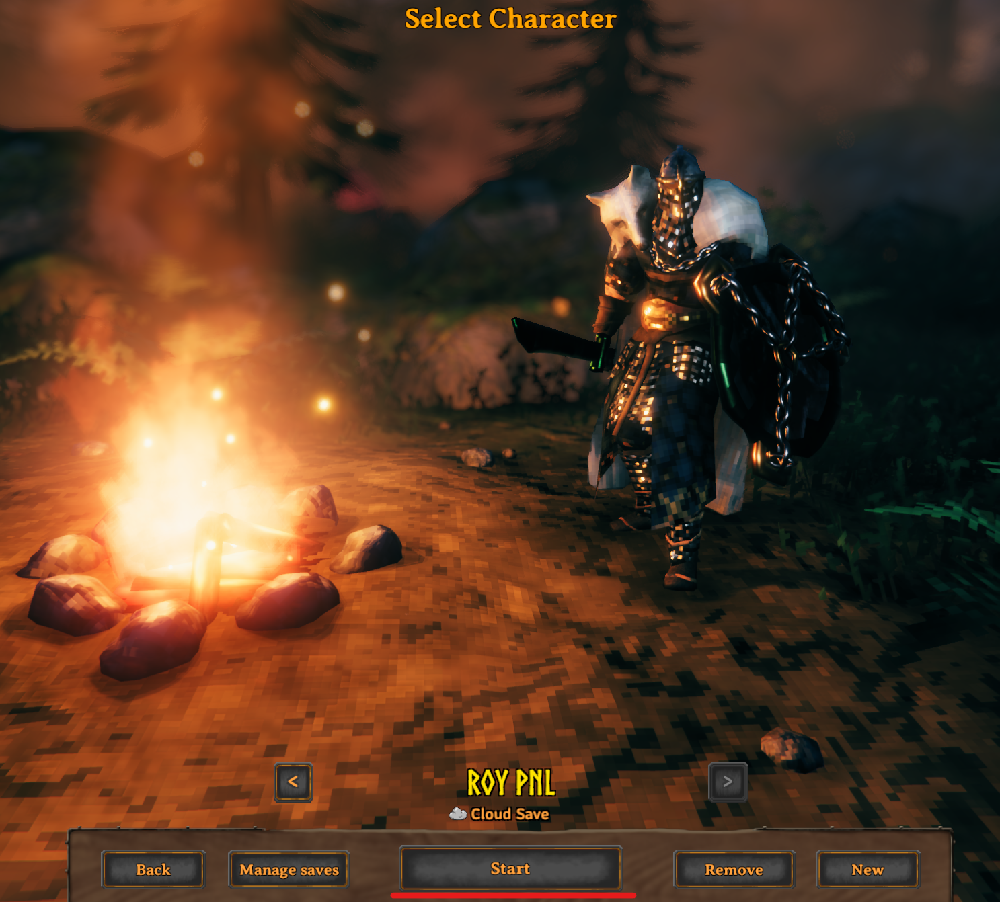
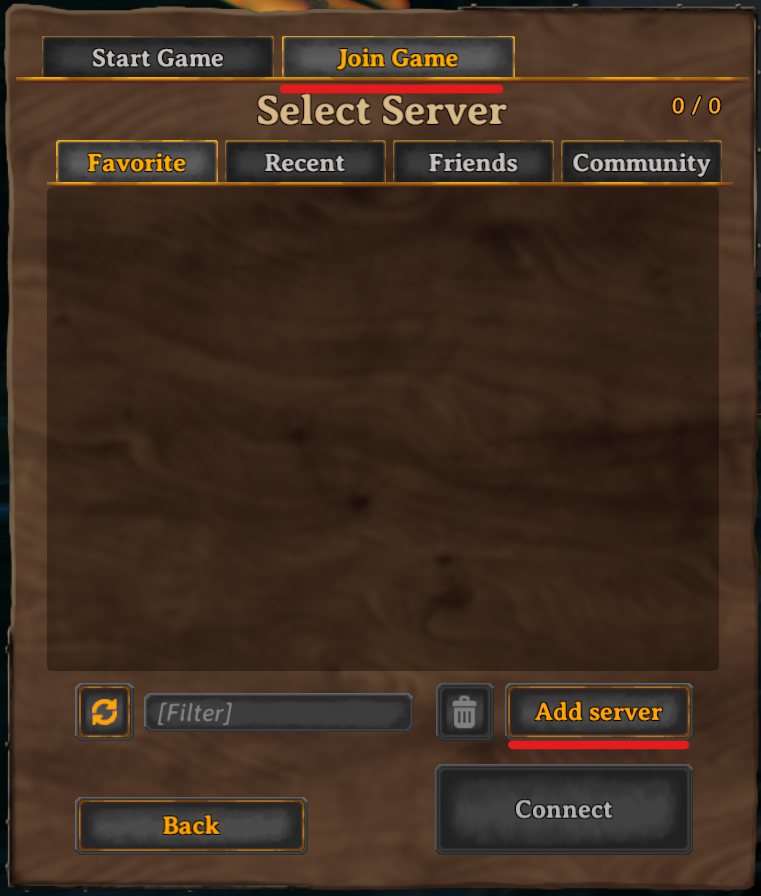
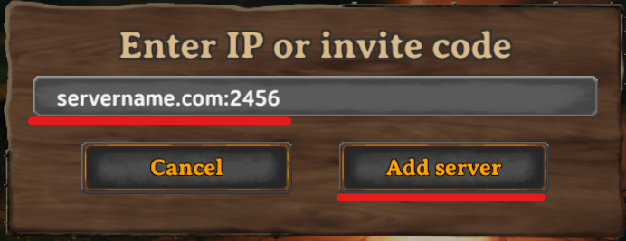
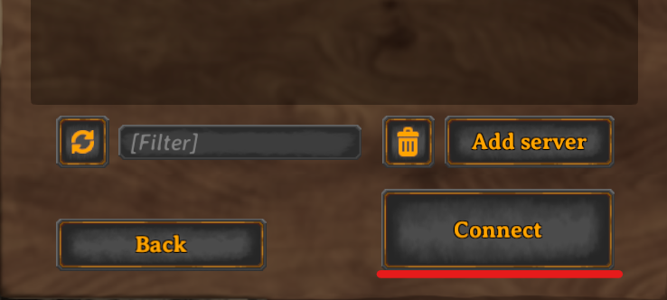
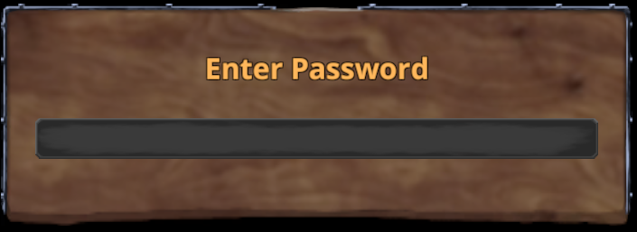
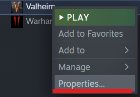
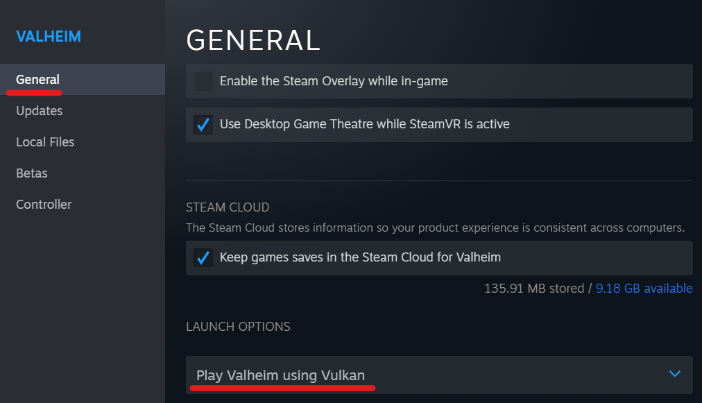
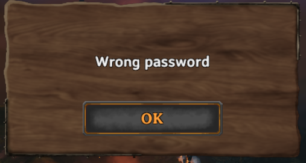

# Valheim Players Guide

## Table of Contents

1. [Overview](#overview)
2. [Rules](#rules)
3. [Access Server](#access)
4. [Troubleshooting](#issues)

## Overview 
Welcome to Cityhallin's Valheim Server Guide.

## Rules 
Review the rules for this Valheim Server.

- Be respectful
- Do not impact other player's game play unless there is a challenge that specifically gives instructions for this
- Do not use unauthorized mods

## Access Server 
Review the instructions below to access Cityhallin Valheim Dedicated Servers:

1. Open Steam, click on your Valheim game, and see if it needs updates. If it needs updates, it will have a blue **Update** button. 
 
If it is already up to date, it will have a green **Play** button. Once you have the green **Play** button, click it to start Valheim. 

 
 

 
 

2. If you arrive at the Valheim Start screen, click **Start Game**

 
 

3. Once your character is selected, click **Start**

 
 

4. Click on the **Join Game** tab. Then click on the **Add Server** button to add a Valheim Dedicated Server to your server list. 

 
 

5. Enter the Server name your server admin gave to you. This is normally followed by a colon (:) and a port number. This port number is normally **2456**, but check with your server admin. Once the server name is added, click the **Add Server** button.

 
 

5. Once the server is added to your server list, highlight the server and click the **Connect** button. 

 
 

6. The server will ask for a password. Your server admin should provide you this password. Type in this password and hit **Enter** on your keyboard. You should now be logged into the Valheim Server. 

 
 

## Troubleshooting 
The tips below can help if you have any issues. 
 
 

### Game Frame Rate Slow
Sometimes the framerate seems to be slow. If you have a video card that supports Vulkan, try to enable Valheim to use it on launch. 
1. In your steam game library, right click on Valehim and go to properties. 

 

2. In the General section, set Launch Options to **Play Valheim using Vulkan**

 
 

### Wrong Password Message
The **Wrong Password** message appears when the server password entered is incorrect. Check with your server admin to make sure the password you received is correct. Also make sure you do not have CAPS lock enabled on your kyeboard. 

 
 

